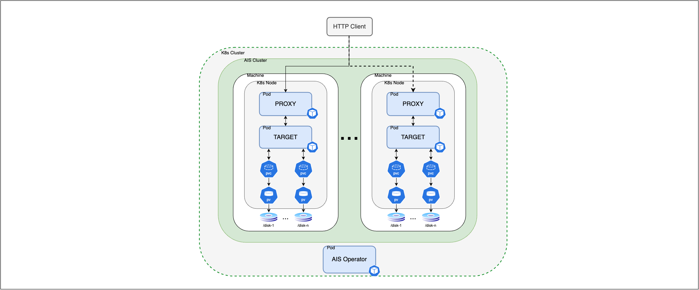

# AIStore on Kubernetes

[AIStore](https://github.com/NVIDIA/aistore) is a lightweight, scalable object storage solution designed for AI applications. This repository serves as a complete toolkit for setting up AIStore in a Kubernetes environment, accommodating both managed Kubernetes services and bare-metal Kubernetes setups.

## Overview

This repository includes a variety of resources to facilitate your deployment:

- [**Documentation/Guide**](docs/README.md): This section provides detailed, step-by-step instructions for deploying AIStore on Kubernetes (K8s), covering essential [deployment scenarios and considerations](docs/k8s_discussion.md).
- [**Ansible Playbooks**](playbooks/README.md): These playbooks are designed to streamline the setup of Kubernetes worker nodes for hosting AIStore deployments.
- [**Kubernetes Operator**](operator/README.md): AIS K8s Operator simplifies critical tasks such as bootstrapping, deployment, scaling, graceful shutdowns, and upgrades. It extends Kubernetes' native API, automating the lifecycle management of AIStore clusters.
- [**Helm Charts**](helm/README.md): **[In development]**. Helm charts for deploying AIS resources to be controlled by the operator (alternative to ansible).
- [**Monitoring**](monitoring/README.md): This guide provides detailed instructions on how to monitor AIStore using both command-line tools and a Kubernetes-based monitoring stack.
- [**Terraform Definitions**](terraform/README.md): These definitions facilitate the deployment of AIStore on public cloud platforms like GKE/GCP. **[No Longer Supported]**

## A Simple System Overview

The diagram illustrates a AIStore deployment on Kubernetes spread across multiple nodes, each containing a `proxy` and a `target` pod. The `proxy` routes client requests to the `target` pods, which handle data storage and retrieval. These pods utilize Persistent Volume Claims (PVCs) linked to Persistent Volumes (PVs) corresponding to actual storage disks. The AIS Operator oversees the entire setup, managing all operations related to the cluster.

## Small Scale Experimental Deployments

This repository mainly focuses on production deployments of AIStore with multiple nodes each with multiple drives. If you don't require such scale then consider checking out the [different deployment options available](https://github.com/NVIDIA/aistore?tab=readme-ov-file#deployment-options).

## Deployment Guide

To successfully implement a multi-node deployment of AIStore in a production environment, thorough planning and strategic configuration decisions are essential. We recommend reviewing our [Key Deployment Scenarios](docs/k8s_discussion.md) to determine the specific needs and objectives for your cluster. For a clear and detailed roadmap, our [Step-by-Step Deployment Guide](docs/README.md) provides extensive instructions and best practices for setting up AIStore clusters on Kubernetes.

## AIStore Operator

The AIS Operator is a key component in the ais-k8s system. It helps manage everything in an AIStore cluster, making tasks like starting, deploying, adjusting size, shutting down smoothly, and updating easier. It effectively handles AIStore resources within Kubernetes, adding to the Kubernetes API to fully automate the AIStore's lifecycle.

> Important: Our deployment guide focuses on using the AIStore Operator for an easy and integrated setup process.

## AIStore Cloud Deployment with Terraform (No Longer Supported)

> Notice: We are no longer updating our Terraform definitions and scripts. We suggest using the [AIS Operator](operator/README.md) alongside [Ansible Playbooks](playbooks/README.md) for setting up and managing AIStore Clusters. However, we aim to resume support for Terraform soon.

Our Terraform resources were previously designed to facilitate the deployment of AIStore clusters on Kubernetes within a cloud environment. This approach involved using Terraform to establish a Kubernetes cluster on your chosen cloud provider, followed by the deployment of AIStore onto Kubernetes using `kubectl` and `helm`. 

If you encounter any problems during the deployment process or in `AIS Operator`, feel free to report them on the [AIStore repository's issues page](https://github.com/NVIDIA/aistore/issues).