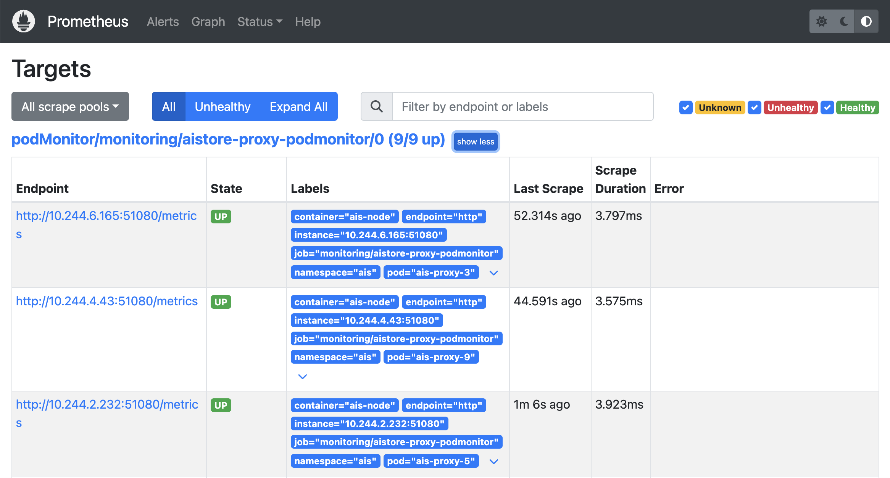
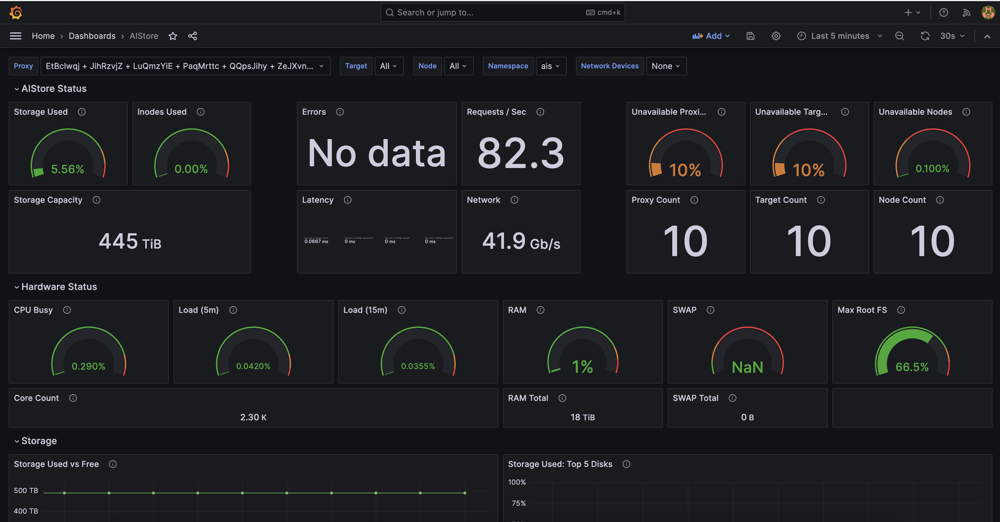

# AIStore K8s Deployment Guide

This document provides comprehensive, step-by-step guidance for deploying [AIStore](https://github.com/NVIDIA/aistore) clusters on Kubernetes (K8s). With a little bit of planning and preparation, AIStore can be optimally deployed on K8s, so let's embark on this journey together.


# Contents

1. [**AIStore K8s Deployment Guide**](#aistore-k8s-deployment-guide)
2. [**Key Points to Remember**](#key-points-to-remember)
3. [**Prerequisites**](#prerequisites)
4. [**Deployment Steps**](#deployment-steps)
   - [Kubernetes Installation](#kubernetes-installation)
   - [Node Setup](#node-setup)
     - [Disk Configuration](#disk-configuration)
     - [Network Setup](#network-setup)
   - [Operator Deployment Procedure](#operator-deployment-procedure)
   - [AIStore Cluster Creation Process](#aistore-cluster-creation-process)
   - [Setting Up a Debugging Pod](#setting-up-a-debugging-pod)
5. [**Post-Deployment Steps**](#post-deployment-steps)
   - [Monitoring - Using CLI](#monitoring-using-cli)
   - [Monitoring - Using kube-prometheus-stack](#monitoring-using-kube-prometheus-stack)
     - [Node Labeling for Monitoring](#node-labeling-for-monitoring)
     - [Creating a Monitoring Namespace](#creating-a-monitoring-namespace)
     - [Deploy kube-prometheus-stack](#deploy-kube-prometheus-stack)
     - [Configuring Prometheus (Pod) Monitors](#configuring-prometheus-pod-monitors)
     - [Accessing Prometheus UI](#accessing-prometheus-ui)
     - [Setting Up Grafana Dashboard](#setting-up-grafana-dashboard)
   - [Performance Testing with aisloader](#performance-testing-with-aisloader)

## Key Points to Remember:
- While AIStore doesn't necessarily require K8s for deployment, using K8s significantly simplifies large, multinode deployments. We employ Ansible for this process.
- A basic understanding of K8s is assumed. However, more complex deployment scenarios will naturally demand a higher level of K8s expertise.
- For an in-depth exploration of key deployment scenarios and their respective guidelines, please consult the [Kubernetes Deployment Discussion Document](k8s_discussion.md).

## Prerequisites

Before starting the deployment, ensure the following prerequisites are met:

For bare-metal deployments:
- **Kubespray Installation**: Follow the instructions provided in this [Kubespray document]](kubespray)

For both bare-metal and managed K8s deployments:
- **Kubernetes**: Version 1.27.x or later.
- **Operating System (OS)**: Compatible with any Linux-based OS, though Ubuntu 22.04 is preferred.
- **Drives**:
  - AIStore's performance scales with the number and type of disks used. A separate [playbook](../playbooks/docs/ais_datafs.md) is available for disk formatting and mounting as required by AIS. We recommend NVMe drives, formatted with XFS, and mounted with specific options (no RAID setup). Mount options: noatime, nodiratime, logbufs=8, logbsize=256k, largeio, inode64, swalloc, allocsize=131072k, nobarrier.

- **Network**:
The network setup plays a pivotal role in AIStore's performance. Here's a detailed breakdown of the recommended network configuration:
   1. **Network Interface and Settings**:
      - We recommend a 100 Gigabit Ethernet (GbE) network interface to ensure high-speed data transfer.
      - Enable Jumbo Frames, which allows for larger packet sizes, reducing overhead and improving performance.
      - Enable Multiqueue as it helps in distributing network traffic processing across multiple CPU cores, enhancing network throughput and performance.

   2. **Intracluster and Internet Connectivity**:
      - Ensure robust intracluster communication. This is vital for the smooth interaction between different components of the AIStore cluster.
      - Maintain reliable internet access. This is crucial for downloading AIStore components and for seamless integration with cloud-based storage backends.

   3. **Port Configuration**:
      The following port settings are essential for AIStore operation and need to be configured appropriately:
      - **General Requirement**:
      - Open outbound ports 51080 and 51081 for ingress traffic to allow external access to the AIS cluster.
      - **ProxySpec Settings**:
      - `servicePort`: 51080 (used for general service access)
      - `portPublic`: 51080 (public-facing port for external communication)
      - `portIntraControl`: 51081 (internal control communication within the cluster)
      - `portIntraData`: 51082 (data transfer within the cluster)
      - **TargetSpec Settings**:
      - `servicePort`: 51081 (service port dedicated for target nodes)
      - `portPublic`: 51081 (public-facing port for target nodes)
      - `portIntraControl`: 51082 (control port for internal communication among target nodes)
      - `portIntraData`: 51083 (data transfer port among target nodes)
      - **ServiceAuth**:
      - Port `52001` is used for service authentication purposes.

   Some additional information about [network](https://github.com/NVIDIA/aistore/blob/master/docs/performance.md#network).
- **AIS Nodes**:
  - While AIStore is resource-efficient, some extensions like ETL and Resharding demand more CPU and Memory. We recommend nodes with 32 CPUs and 64 GB of Memory.
- **Host Configuration**:
  - Prepare an Ansible host file akin to [`hosts.ini`](kubespray/hosts.ini) for various playbook deployments.


## Deployment Steps

### Kubernetes Installation

- **Managed K8s**: Strongly recommended for production deployments to avoid potential troubleshooting complexities.
- **Bare-Metal K8s**: For those preferring manual setup, refer to the [`kubespray`](kubespray) documentation. Remember to specify the controller node in the `hosts.ini` file.

Make sure to specify the `controller` node in the `hosts.ini` file that will have the `kubectl` access to the whole cluster.

After setting up K8s, ensure all nodes are in the `Ready` state and required pods are `Running` from the controller node:
```
$ kubectl get nodes
$ kubectl get pods -A
```


### Node Setup

#### Disk Configuration
Format all drives with XFS and mount them under `/ais/<device>` (e.g., `/ais/sda/nvme0n1`). Use the [ais_datafs_mkfs playbook](https://github.com/NVIDIA/ais-k8s/blob/master/playbooks/docs/ais_datafs.md) for assistance.

#### Network Setup

1. **Internet and DNS Verification**:
   Confirm proper internet connectivity and DNS resolution (e.g., test with `ping github.com`).

2. **Multi-queue Verification/Enablement**:
   Check and enable multi-queue settings for network interfaces, especially on Linux systems. The `ethtool` command can be used for this purpose. Instructions are detailed in the [ais_enable_multiqueue playbook](../playbooks/docs/ais_enable_multiqueue.md).

3. **Optional Network Testing**:
   Conduct `iperf` tests between nodes to ensure robust network performance before deployment.

#### AIS Configuration Playbooks

To assist you in setting up your system for AIStore, we've included a comprehensive set of [configuration Ansible playbooks](../playbooks). For an effective initial setup, we suggest executing the [`ais_host_config_common guide`](../playbooks/docs/ais_host_config_common.md), especially with the `aisrequired` tag. This will help you fine-tune your system to meet AIStore's requirements, ensuring optimal performance.

### Operator Deployment Procedure

With Kubernetes installed and the nodes properly configured, it's time to deploy the AIS Operator. This operator is crucial for managing the AIStore cluster within the Kubernetes environment.

**Guidance Document**:
- Refer to the [ais_cluster_management](../playbooks/docs/ais_cluster_management.md) for detailed instructions on navigating the entire lifecycle of an AIS cluster. This includes all the necessary steps to deploy both the operator and a multi-node AIS cluster on Kubernetes.

**Deployment Steps**:
1. **Preparation**:
   - Begin by updating the AIS Operator's version. Modify the version specified in the [defaults file](../playbooks/roles/ais_deploy_operator/defaults/main.yml) to match the latest released version. This ensures you are deploying the most up-to-date version of the operator.

2. **Building the Operator (Optional)**:
   - If you require customizations or want to incorporate specific changes to the operator, you have the option to build the operator from scratch. This step is optional and is recommended only if you need to deviate from the standard operator setup.

3. **Running the Deployment Playbook**:
   - Use the [ais_deploy_operator playbook](../playbooks/ais_deploy_operator.yml) to deploy the operator. Execute the playbook by running the following commands from the root of the ais-k8s repository:
     ```
     $ cd ais-k8s
     $ ansible-playbook -i /path/to/host.ini playbooks/ais_deploy_operator.yml
     ```
     This command triggers the Ansible playbook, which automates the deployment process of the AIS Operator on your Kubernetes cluster.

4. **Verification**:
   - After the playbook execution, verify the successful deployment of the AIS Operator. Use `kubectl` on the `controller` node to check the status of the deployed pods:
     ```
     $ kubectl get pods -n ais-operator-system
     ```
     The AIS Operator pod should be in the `Running` state, indicating a successful deployment.

By following these steps, you'll have the AIS Operator deployed and running, ready to manage the AIStore cluster on your Kubernetes environment. This setup is integral to ensuring that your AIS cluster operates efficiently and effectively.


### AIStore Cluster Creation Process

Having successfully deployed the AIS Operator, the next critical step is to establish an AIStore cluster. This process is streamlined through the [`ais_deploy_cluster.yml`](../playbooks/ais_deploy_cluster.yml) playbook, which encompasses several key tasks:

1. **Persistent Volumes and Node Labeling**:
   - The playbook automates the creation of Persistent Volumes (PVs) for local persistent storage, ensuring a stable storage foundation for the cluster.
   - Kubernetes nodes are labeled systematically to facilitate the deployment of AIS proxy and target pods, ensuring proper placement and management of these components.

2. **Namespace Creation**:
   - It sets up a dedicated Kubernetes namespace, providing an isolated environment where the AIStore cluster will reside.

3. **AIS Custom Resource Deployment**:
   - The playbook concludes with the deployment of an AIS Custom Resource, signifying the establishment of the AIStore cluster within the Kubernetes ecosystem.

Before initiating the playbook, it's crucial to perform some preparatory configurations:

- **Mount Path Configuration**:
  - Update the [`ais_mpaths`](../playbooks/vars/ais_mpaths.yml) variable with a list of mount paths for each node in the cluster. This can be done by editing the `vars/ais_mpaths.yml` file or using a command-line argument. For instance, `-e ais_mpaths=["/ais/sda", "/ais/sdb", ... , "/ais/sdj"]`.

- **Mount Path Size Specification**:
  - Define the size of each mount path in the [`ais_mpath_size`](../playbooks/ais_datafs_mkfs.yml) variable. Sizes can be specified in formats like '9Ti' or '512Gi'.

- **Device Configuration Example**:
  - Consider this example output from `lsblk`:
    ```
    NAME        MAJ:MIN RM  SIZE RO TYPE MOUNTPOINT
    ...
    nvme0n1     259:12   0  6.2T  0 disk /ais/nvme0n1
    ...
    nvme7n1     259:6    0  6.2T  0 disk /ais/nvme7n1
    ```
    Based on this, your configuration in `ais_mpaths.yml` would be:
    ```yaml
    ais_mpaths:
      - "/ais/nvme0n1"
      ...
      - "/ais/nvme7n1"

    ais_mpath_size: 6.2Ti
    ```
    And your `ais_datafs.yml` should list all devices:
    ```
    ais_devices:
     - nvme0n1
     ...
     - nvme7n1
    ```

- **Multihome Deployment**:
   - For a multihome deployment using multiple network interfaces, some extra configuration is required before deploying the cluster. Refer to the [multihome deploment doc](../playbooks/docs/deploy_with_multihome) for details. 

- **Playbook Defaults**:
  - In the [defaults file](../playbooks/roles/ais_deploy_cluster/defaults/main.yml) for the deploy cluster playbook, update values such as:
    - `node_image`: Specify the Docker image for AIS target/proxy containers (e.g., `aistorage/aisnode:v3.21`). Find the latest image at the [AIS Docker Hub repository](https://hub.docker.com/r/aistorage/aisnode/tags).
    - `gcp_secret_name`/`aws_secret_name`: For cloud backend integration, create a Kubernetes secret with the necessary credentials as described in this [cloud credentials playbook](../playbooks/cloud/README.md).
    - Protocol: Choose between 'http' or 'https'. For 'https', you'll need to create and provide the required certificate as a secret, detailed in [`ais_https_cert`](../playbooks/docs/ais_https_cert.md).

After these configurations, execute the playbook and monitor the pod statuses until they are all in the `Running` stage:
```
$ watch kubectl get pods -n <cluster-namespace>
```

**Important Note**: In some Kubernetes deployments, the default cluster domain name might differ from `cluster.local`. If this is the case, update the `clusterDomain` parameter in the playbook [templates](../playbooks/roles/ais_deploy_cluster/templates/ais.yaml.j2) accordingly.

With these steps, your AIStore cluster on Kubernetes should be up and running. 

### Setting Up a Debugging Pod

To effectively interact and troubleshoot within your cluster, it's beneficial to deploy a dedicated debug pod. This can be a valuable tool for troubleshooting and ensuring that everything is functioning as expected.

To get started, refer to the [aisnode_debug.yaml](ais-monitoring/aisnode_debug.yaml) found in the `docs/ais-monitoring` directory. This file contains the configuration for a lightweight debug container. Deploy it into the `ais` namespace with the following command:

```bash
kubectl apply -f /ais-k8s/docs/ais-monitoring/aisnode_debug.yaml
```
After the pod is deployed, give it a moment to initialize. Once ready, access the pod using:

```bash
kubectl -n ais exec -it pods/aisnode-debug -- bash
```

Inside the debug pod, set up the environment to connect to the AIStore cluster. You can do this by setting the `AIS_ENDPOINT` environment variable to the proxy's service address:

```bash
export AIS_ENDPOINT=http://aistore-proxy:51080
```

The pod comes with the `ais` [CLI (command-line interface)](https://github.com/NVIDIA/aistore/blob/master/docs/cli.md) preinstalled. You can utilize the `ais` CLI to interact with your cluster. For example, to view the cluster's status, you can run:

```bash
ais cluster show
```

With this, you’ve established a functional AIStore cluster and have a dedicated environment for direct interaction and testing.

## Post-Deployment Steps

This section focuses on setting up monitoring and benchmarking for your AIStore cluster. While these steps are optional, they are crucial for understanding your cluster's performance and identifying areas needing improvement.

### Monitoring - Using CLI

AIStore provides a [CLI (command-line interface)](https://github.com/NVIDIA/aistore/blob/master/docs/cli.md) with a [`show performance`](https://github.com/NVIDIA/aistore/blob/master/docs/cli/show.md#ais-show-performance) command. This command offers a snapshot of the cluster's performance, including throughput, latencies, disk IO, capacity, and more.

### Monitoring - Using kube-prometheus-stack
You can setup your own k8s stack for monitoring. For a comprehensive monitoring setup, we recommend the [kube-prometheus-stack](https://github.com/prometheus-community/helm-charts/tree/main/charts/kube-prometheus-stack) helm chart. This chart installs and integrates several components:

   - [Prometheus](https://prometheus.io/) and the [Prometheus Operator](https://github.com/prometheus-operator/prometheus-operator)
   - [AlertManager](https://prometheus.io/docs/alerting/latest/alertmanager/)
   - [Grafana](https://grafana.com/)
   - [kube-state-metrics](https://github.com/kubernetes/kube-state-metrics)
   - [node_exporter](https://github.com/prometheus/node_exporter)

This setup forms a foundational monitoring stack that can be extended as needed.


#### Node Labeling for Monitoring
   Identify nodes designated for monitoring.
   
   ```bash
   kubectl get nodes
   ```
   > Note: In larger deployments, label only the nodes allocated for monitoring.

   Label these nodes accordingly:
   ```bash
   kubectl label node/node-01 'aistore.nvidia.com/role_monitoring=true'
   ...
   ```

#### Creating a Monitoring Namespace
This namespace will house all monitoring-related nodes and services.
```bash
kubectl create ns monitoring
```

### Deploy kube-prometheus-stack
Ensure `helm` is installed. If not, follow the [installation guide](https://helm.sh/docs/intro/install/).

1. Install Helm using the provided script:
   ```bash
   curl -fsSL -o get_helm.sh https://raw.githubusercontent.com/helm/helm/main/scripts/get-helm-3
   chmod 700 get_helm.sh
   ./get_helm.sh
   ```

2. Add the prometheus-community repo to Helm:
   ```bash
   helm repo add prometheus-community https://prometheus-community.github.io/helm-charts
   helm repo update
   ```

3. Customize the chart values by editing [`kube_prometheus_stack_values.yaml`](ais-monitoring/kube_prometheus_stack_values.yaml). This involves setting `nodeAffinity`, `grafanaAdminPassword`, persistent stats storage (commented), and `securityContext`.

4. For setting the `securityContext`, specify details of a non-root user (typically UID > 1000). To identify existing non-root users, use the following command:
   ```bash
   awk -F: '$3 >= 1000 {print $1}' /etc/passwd
   ```
   Alternatively, you can either use an existing non-root user or create a new one. To obtain the UID and Group ID (GID) of a user, execute:
   ```bash
   id [username]
   ```
   Then, update the `kube_prometheus_stack_values.yaml` file with the user's UID and GID by setting the `runAsUser` and `runAsGroup` fields, respectively, under `securityContext`. Also, don't forget to set the `grafanaAdminPassword`.

> Important: If your monitoring nodes are labeled differently, remember to adjust the `key` value in the nodeAffinity configuration within the same file to match your custom label. The default setting is `aistore.nvidia.com/role_monitoring=true`.

#### Chart Deployment
Deploy the Prometheus stack with customized values:
```bash
helm install -f ais-k8s/docs/ais-monitoring/kube_prometheus_stack_values.yaml kube-prometheus-stack prometheus-community/kube-prometheus-stack --namespace monitoring
```

#### Configuring Prometheus (Pod) Monitors
At this point, you'll have a prometheus instance running that mostly just monitors itself.

To monitor AIS, we'll need to add a couple of [PodMonitor](https://github.com/prometheus-operator/prometheus-operator/blob/main/Documentation/api.md#monitoring.coreos.com/v1.PodMonitor) definitions.

> Why not [ServiceMonitors](https://github.com/prometheus-operator/prometheus-operator/blob/main/Documentation/api.md#monitoring.coreos.com/v1.ServiceMonitor)?
> 
> The aistore deployment includes two services, `aistore-proxy` and `aistore-target`. Whilst you *could* scrape these from prometheus using a ServiceMonitor instead, the metrics aistore provides are specific to each proxy and target, and connecting to the service for metrics will follow a round-robin pattern. For a large deployment, with a 30 second scrape interval, this means that some metrics will inevitably be lost as each pod will be scraped infrequently.

You can find two `PodMonitor` definitions in the file [`docs/ais-monitoring/ais_podmonitors.yaml`](ais-monitoring/ais_podmonitors.yaml). Apply them:

```
kubectl -n monitoring apply -f /ais-k8s/docs/ais-monitoring/ais_podmonitors.yaml
```

When applied, the monitors will configure prometheus to scrape metrics from AIStore's proxy and target pods individually every 30 seconds.

#### Accessing Prometheus UI
The UI is not directly accessible from outside the cluster. Options include changing the service type to `NodePort` or using port-forwarding:
```bash
kubectl edit svc kube-prometheus-stack-prometheus -n monitoring
# change `type: ClusterIP` to `type: NodePort`

# or use port-forwarding:
kubectl port-forward -n monitoring svc/kube-prometheus-stack-prometheus 9090
```
Access the UI via `http://localhost:<port>`. Find the NodePort/port assigned to the service:
```bash
kubectl get svc kube-prometheus-stack-prometheus -n monitoring
```
> Note: Depending on how you have configured you might need to `ssh -L <port>:localhost:<port> <user-name>@<ip-or-host-name>` into the machines port and view `localhost:<port>`.


 
### Setting Up Grafana Dashboard
`kube-prometheus-stack`'s grafana deployment makes use of the [kiwigrid k8s sidecar](https://github.com/kiwigrid/k8s-sidecar) image, which allows us to provide our own dashboards as Kubernetes [configMaps](https://kubernetes.io/docs/concepts/configuration/configmap/).

A sample dashboard can be found at [`docs/ais-monitoring/aistore_dashboard.yaml`](ais-monitoring/aistore_dashboard.yaml). Apply it:

```
kubectl apply -n monitoring -f /ais-k8s/docs/ais-monitoring/aistore_dashboard.yaml 
```

Similar to Prometheus, to access Grafana dashboard you will have to either change the service type to `NodePort` or using port-forwarding:
   ```bash
   kubectl edit svc kube-prometheus-stack-grafana -n monitoring
   # change `type: ClusterIP` to `NodePort` or use port-forwarding:
   # or, use port-forwarding
   kubectl port-forward -n monitoring svc/kube-prometheus-stack-grafana 3000:80
   ```
Access the UI via `http://localhost:<port>`. Find the NodePort/port assigned to the service:
```bash
kubectl get svc kube-prometheus-stack-grafana -n monitoring
```
> Note: Depending on how you have configured you might need to `ssh -L <port>:localhost:<port> <user-name>@<ip-or-host-name>` into the machines port and view `localhost:<port>`.

You'll need to use the username `admin` and the `grafanaAdminPassword` you chose earlier to log in.



Once logged in, you can import more dashboards to make the most of the `node-exporter` and `kube-state-metrics` deployments bundled with the chart if you wish.

### Performance Testing with aisloader

For evaluating the efficiency of your storage cluster, the load generator `aisloader` is a useful tool. Detailed information about `aisloader` is available in its [documentation](https://github.com/NVIDIA/aistore/blob/master/docs/aisloader.md). Additionally, a specialized toolkit, known as [`aisloader-composer`](https://github.com/NVIDIA/aistore/tree/master/bench/tools/aisloader-composer), has been developed which includes a variety of scripts and Ansible playbooks, enabling comprehensive benchmarking of an AIStore (AIS) cluster across multiple hosts. These hosts are equipped with `aisloader` and are collectively managed through Ansible. You can find the setup instructions for `aisloader-composer` and examples of benchmark scripts [here](https://github.com/NVIDIA/aistore/tree/master/bench/tools/aisloader-composer).

Happy deploying! 🎉🚀🖥️

If you encounter any problems during the deployment process, feel free to report them on the [AIStore repository's issues page](https://github.com/NVIDIA/aistore/issues). We welcome your feedback and queries to enhance the deployment experience.