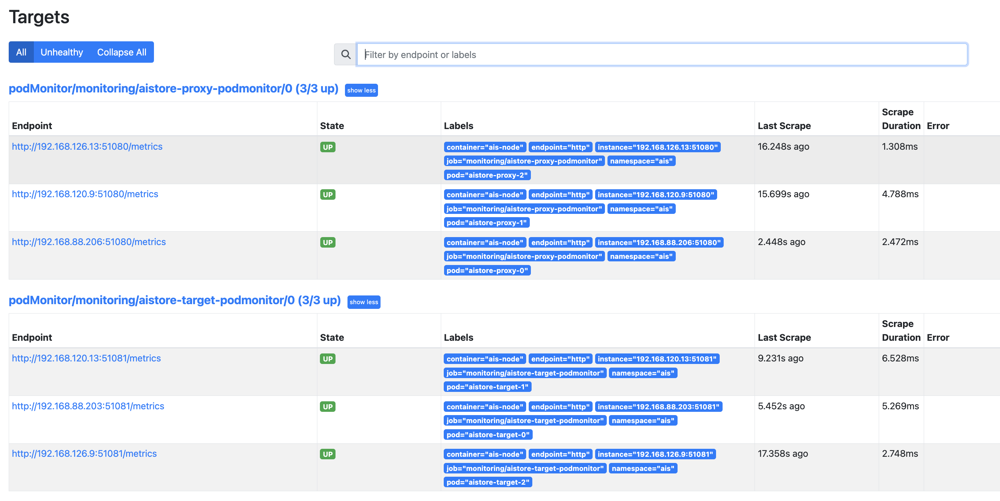
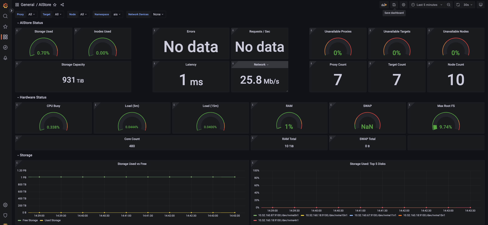

# AIStore: Kubernetes Operator Deployment Walkthrough

This guide walks you through a complete AIStore deployment on [Kubernetes](https://kubernetes.io/), including a simple monitoring stack based on [Prometheus](https://prometheus.io/).

Like all storage systems, AIStore relies heavily on the type and quality of the underlying disks on the physical infrastructure. For that reason, this guide will take you through a complete physical build, starting from building out a Kubernetes cluster itself. 

You may have your own ways of consuming or deploying Kubernetes, different from those described here. If so, you may want to run through a [small virtual deployment](#example-virtual-environment) to familiarize yourself with it, then  pick the parts of this walkthrough that are of use to you, and use them as a guide.

## Contents

 - [Tooling](#tooling)
 - [Hardware / OS Setup](#hardware-os-setup)
 - [Configure the OS with Ansible](#confgure-the-os-with-ansible)
 - [Deploy Kubernetes](#deploy-kubernetes)
 - [Post Kubernetes Deployment](#post-kubernetes-deployment)
 - [AIStore Operator Deployment](#aistore-operator-deployment)
 - [AIStore Cluster Deployment](#aistore-cluster-deployment)
 - [Add Monitoring](#add-monitoring)

## Tooling
To perform the deployment, we're going to use the following:

- [Ansible](https://www.ansible.com/), to perform various bare metal configuration tasks.
- [Kubespray](https://github.com/kubernetes-sigs/kubespray), to deploy a Kubernetes cluster.
- [AIStore Kubernetes Operator](https://github.com/NVIDIA/ais-k8s/tree/master/operator), to deploy and manage an [AIStore](https://github.com/NVIDIA/aistore) storage cluster on Kubernetes.
- [Prometheus](https://prometheus.io/), [Grafana](https://grafana.com/), [kube-state-metrics](https://github.com/kubernetes/kube-state-metrics) and [node_exporter](https://github.com/prometheus/node_exporter), to provide visibility into the state of our cluster
  - Prometheus can be deployed using [helm](https://helm.sh/), [kube-prometheus-stack](https://github.com/prometheus-community/helm-charts/tree/main/charts/kube-prometheus-stack), and/or the [Prometheus Operator](https://github.com/prometheus-operator/prometheus-operator).

You'll be shown how to install these tools in the steps below.

## Hardware / OS Setup

AIStore has no size and number-of-nodes limitations. The cluster can consist of a single machine running a single AIS gateway pod and a single AIS target pod. On the other hand, the cluster can consist of (or grow to) 1000s of nodes, and more. 

For a variety of reasons, though, a 3-node cluster is considered a good start. Ideally, you'd have another 3 Kubernetes nodes for monitoring; the stack in use here (based on Prometheus) can be expensive to run, and it's best to allocate another, smaller set of nodes dedicated to this purpose if possible.

 - Storage nodes should have physical disks attached as block devices. The faster, the better.
 - Monitoring nodes do not have any particular requirements for storage devices. The default monitoring deployment shown here uses ephemeral storage for metrics.

For a smaller, test deployment, the same nodes used for storage can also be used for monitoring.

In addition:

 - Your nodes should be running Ubuntu 18.04, 20.04, or 22.04, or variants thereof.
 - All nodes will need to be on the same IPv4 subnet. 
 - Each host should be able to resolve the other's hostnames, be it via DNS, or local `/etc/hosts` files. 
 - The node clocks should be synchronized.

### Example Virtual Environment
To try out an AIStore deployment, a hosted hypervisor such as [VirtualBox](https://www.virtualbox.org/) or [QEMU](https://www.qemu.org/) allows you to spin up environments like this one easily on your workstation with virtual block devices.

A root filesystem size of 40GB is more than enough for a sample virtual deployment.

| Node Type              | Purpose               | Node Count | Cores | RAM | Block Devices                                                        | Networking |
|------------------------|-----------------------|-------|-------|-----|----------------------------------------------------------------------|------------|
| Storage and Monitoring | Runs AIStore *and* monitoring services | 3     | 3     | 4Gb | 3 x 10Gb virtualized SATA (`/dev/sdb`, etc)| 1Gbit      |

### Example Physical Environment
For larger environments, we recommend faster networking, NVMe drives, and that you use separate nodes to run AIStore and monitoring services.

| Node Type  | Purpose                 | Node Count | Cores | RAM   | Block Devices                                 | Networking |
|------------|-------------------------|------------|-------|-------|-----------------------------------------------|------------|
| Storage    | Runs AIStore services   | 10         | 32    | 128Gb | 32 x NVMe / SSD (`/dev/nvme1`, etc), 1Tb apiece | 10 Gbit    |
| Monitoring | Run monitoring services | 3          | 8     | 16Gb  | None unless you choose to persist metrics     | 10 Gbit    |

For simplicity, our examples in the walkthrough use the [virtual environment](#example-virtual-environment) above. The same steps will work in larger environments too. 

### Linux user accounts
We'll add two Linux users for our deployment:

 - `aisdeploy`: Used for deployment purposes only; needs [full, passwordless sudo access](https://www.sudo.ws/docs/man/sudoers.man/#PASSWD) and [passwordless SSH access](https://www.redhat.com/sysadmin/passwordless-ssh) on each machine from your deployment node (typically the first machine in your cluster, but can be elsewhere).
 - `aismonitor`: Used to run our monitoring pods via a [Kubernetes Security Context](https://kubernetes.io/docs/tasks/configure-pod-container/security-context/). Does not need any special permissions.

For the purposes of this guide, we'll assume the `aisdeploy` user has a uid / gid of `1001 / 1001`, and the `aismonitor` user a uid / gid of `1002 / 1002`.

```console
sudo useradd -u 1001 -G sudo -m aisdeploy
sudo useradd -u 1002 -G sudo -m aismonitor
```

## Configure the OS with Ansible

> For more information about the steps in this section, see ais-k8s' [ansible documentation](../playbooks/README.md).

Log into your deployment node as `aisdeploy`.  Then:

### Install and Configure Ansible
Install [Ansible](https://www.ansible.com/), using a python3 virtual environment.

```console
cd && sudo apt-get update && sudo apt-get install python3 python3-venv
mkdir aistore_deployment && cd aistore_deployment
python3 -m venv . && . ./bin/activate
pip install --upgrade pip && pip install ansible
```

Clone the ais-k8s repo and navigate to the `playbooks` directory.

```
git clone https://github.com/NVIDIA/ais-k8s.git
cd ais-k8s/playbooks/
```

Now, set up your inventory file using the sample as a base. Copy it:

```
cp -p hosts-example.ini hosts.ini
```

...then edit as appropriate. With a [virtual environment](#example-virtual-environment) like this, for example:

| Hostname | IP Address | Storage devices (10Gb virtual SATA) |
|----------|------------|-------------------------------------|
| node-01  | 10.0.2.10  | /dev/sdb, /dev/sdc, /dev/sdd        |
| node-02  | 10.0.2.11  | /dev/sdb, /dev/sdc, /dev/sdd        |
| node-03  | 10.0.2.12  | /dev/sdb, /dev/sdc, /dev/sdd        |

We would want a `hosts.ini` like this:

```
#
# All cpu nodes, whether active in k8s cluster or not
#
[cpu-node-population]
node-01    ansible_host=node-01 ip=10.0.2.10
node-02    ansible_host=node-02 ip=10.0.2.11
node-03    ansible_host=node-03 ip=10.0.2.12

#
# Active CPU worker nodes - those in AIS k8s cluster
#
[cpu-worker-node]
node-01
node-02
node-03

#
# Kube master hosts
#
[kube-master]
node-01
node-02
node-03

#
# The etcd cluster hosts
#
[etcd]
node-01
node-02
node-03

#
# As it says.
#
[first_three]
node-01
node-02
node-03

#
# As it says.
#
[last_three]
node-01
node-02
node-03

#
# kube-node addresses all worker nodes
#
[kube-node:children]
cpu-worker-node

#
# k8s-cluster addresses the worker nodes and the masters
#
[k8s-cluster:children]
kube-master
kube-node

#
# All nodes - not required by kubespray, so only for admin convenience.
# Loops in active workers of all types, etcd and master hosts.
#
# XXX Tempting to name this 'all', but Ansible seems to expand that to
# mean "all hosts mentioned in the inventory regardless of grouping".
#
[allactive:children]
k8s-cluster
etcd

#
# See kubespray docs/ansible.md
#
[calico-rr]

[es]
node-01
node-02
node-03
```

Set up a local `ansible.cfg`.

```
cp -p ansible-example.cfg ansible.cfg
```

In our case we'll make one edit, shown below.

```
[defaults]
remote_user = aisdeploy
```

Test your ansible configuration as below.

```
ansible -i hosts.ini all -m ping -u aisdeploy
```

> Note
> 
> If your ansible `ping` command fails, check that your deployment host can resolve the hostnames provided in your `hosts.ini` file. If it cannot, add them via DNS, or via `/etc/hosts`.

### Pre-Kubernetes deployment
Before deploying Kubernetes, run the `ais_enable_multiqueue.yml` playbook.

```
ansible-playbook -i hosts.ini ais_enable_multiqueue.yml -e playhosts=cpu-worker-node --become
```

At this point, you'll need to reboot every node.

```
sudo shutdown -r now
```

Log in once more and run the `ais_host_config_common.yml` playbook.

```
cd ~/aistore_deployment
. ./bin/activate
cd ais-k8s/playbooks
ansible-playbook -i hosts.ini ais_host_config_common.yml --tags "aisrequired" --become
```

> Note: if you are setting up a test instance, you may want to add the `aisdev` tag to the command above to add some debugging quality-of-life improvements to the deployment.

## Deploy Kubernetes

### About Kubernetes Networking
We use the default Kubespray network plugin, [Calico](https://www.tigera.io/project-calico/), in the examples below. Multiple [network plugins](https://kubernetes.io/docs/concepts/extend-kubernetes/compute-storage-net/network-plugins/) are available - and we do not recommend any one in particular.

> External cluster access
>
> Whichever network plugin you choose, if the users and application consuming storage work outside of your Kubernetes cluster, they will need to be able to access all of the storage nodes in the cluster.
>
> A simple way to achive this is to allow port forwarding over the 51080 to 5300 range. Another way is to [use a loadbalancer, such as MetalLB](README.md#appendix---ingress-to-aistore))
>
> For more information about the steps here, see ais-k8s' [kubespray documentation](kubespray/README.md).

### Configure and Run Kubespray
Clone [Kubespray](https://github.com/kubernetes-sigs/kubespray), and create a separate virtual python environment to be used for it.

> Note: Ubuntu 18.04
>
> To run recent versions of kubespray on Ubuntu 1804, you'll need to install a newer python 3.
>
> ```
> sudo add-apt-repository ppa:deadsnakes/ppa
> sudo apt-get install python3.10-dev python3.10-venv
> ```
> 
> Once installed, replace `python3` below with `python3.10`.


```
cd && git clone https://github.com/kubernetes-sigs/kubespray.git
cd kubespray
python3 -m venv .   # (Or "python3.10 -m venv ." on Ubuntu 18.04)
. ./bin/activate
pip install install -r requirements.txt
```

Create a new inventory for your own k8s cluster.

```
mkdir inventory/aiscluster
cp -rf inventory/sample/* inventory/aiscluster/
mv inventory/aiscluster/inventory.ini inventory/aiscluster/hosts.ini
```

Edit `inventory/aiscluster/hosts.ini` and set appropriate content. For our example virtual cluster, it should look like this:


```
# ## Configure 'ip' variable to bind kubernetes services on a
# ## different ip than the default iface
# ## We should set etcd_member_name for etcd cluster. The node that is not a etcd member do not need to set the value, or can set the empty string value.
[all]
node-01 ansible_host=10.0.2.10  
node-02 ansible_host=10.0.2.11  
node-03 ansible_host=10.0.2.12  

# ## configure a bastion host if your nodes are not directly reachable
# [bastion]
# bastion ansible_host=x.x.x.x ansible_user=some_user

[kube_control_plane]
node-01
node-02
node-03

[etcd]
node-01
node-02
node-03

[kube_node]
node-01
node-02
node-03

[calico_rr]

[k8s_cluster:children]
kube_control_plane
kube_node
calico_rr
```

Next, edit some kubespray settings.

In `inventory/aiscluster/group_vars/k8s_cluster/addons.yml`, set these:

```
helm_enabled: true
metrics_server_enabled: true
```

In `inventory/aiscluster/group_vars/k8s_cluster/k8s-cluster.yml`, set these:

```
kube_service_addresses: 192.168.0.0/18
kube_pods_subnet: 192.168.64.0/18
kubeconfig_localhost: true
kubectl_localhost: true
```

...and add this to the end of the file:

```
# Allow kube-prometheus-stack to gather kube-proxy metrics
kube_proxy_metrics_bind_address: 0.0.0.0:10249
```

In `inventory/aiscluster/group_vars/k8s_cluster/k8s-net-calico.yml`, set these:

```
nat_outgoing: true
calico_mtu: 1480
```

> Note: The calico MTU depends on your network setup. In general it should be 20 less than your link MTU, as seen by running `ip a`. For a small installation, `1480` is a typical setting; if you are running a production cluster, you should enable [jumbo frames](https://en.wikipedia.org/wiki/Jumbo_frame) if possible in which case a more normal setting would be `8980`.
>
> Where possible, use of jumbo frames is **highly recommended**.
>
> You can discover your network's maximum MTU by running, for example, `ping -M do -s 8972 <remote_system>` (and varying the packet size of `8972`). 
> Subtract 20 from the MTU you discover, and use it to configure the correct calico MTU.


Finally, add some extravars by creating `aiscluster.yaml` as below. This will add the [PodNodeSelector](https://kubernetes.io/docs/reference/access-authn-authz/admission-controllers/#podnodeselector) admission controller to our kube-apiserver arguments; we'll be using it later to separate out storage and monitoring nodes.

```
kube_apiserver_enable_admission_plugins:
  - NodeRestriction
  - PodNodeSelector
```

Test kubespray's ansible connection.

```
ansible -i inventory/aiscluster/hosts.ini all  -m ping -u aisdeploy
```

Finally, run kubespray, including our extravars to add the `PodNodeSelector` admission plugin, to deploy a Kubernetes cluster.

```
ansible-playbook -i inventory/aiscluster/hosts.ini cluster.yml -e "@aiscluster.yaml" --become -u aisdeploy
```

...this will likely take at least 25 minutes.

## Post Kubernetes Deployment
Navigate back to your ais-k8s ansible environment.

```
cd ~/aistore_deployment
. ./bin/activate
cd ais-k8s/playbooks
```

Run the `ais_host_post_kubespray.yml` playbook.

```
ansible-playbook -i hosts.ini ais_host_post_kubespray.yml -e playhosts=k8s-cluster --become
```

Next, set up disks. We're going to create XFS filesystems for all our storage disks, and ensure they are mounted at `/ais/sdX`, ready for use as Kubernetes `hostPath` volumes shortly.

Edit `vars/ais_datafs.yml` and add your disks as shown by `lsblk`. For example:

```
ais_devices:
  - sdb
  - sdc
  - sdd
```

Create and mount filesystems by running the `ais_datafs_mkfs.yml` playbook. This is destructive; you'll need to confirm when asked.
 
<pre>
<strong>ansible-playbook -i hosts.ini ais_datafs_mkfs.yml  -e ais_hosts=cpu-worker-node  --become</strong>
Are you sure you want to destroy and mkfs AIS filesystems on cpu-worker-node, devices ['sdb', 'sdc', 'sdd']? Type 'yes' to confirm. [no]: yes
</pre>

## AIStore Operator Deployment

> For more information about the steps in this section and the next, see ais-k8s' [operator documentation](../operator/README.md).

It's time to deploy the operator. Start by copying the kubeconfig generated by kubespray to your home directory.

```
sudo cp -p /etc/kubernetes/admin.conf $HOME/
sudo chown aisdeploy:aisdeploy ~/admin.conf
export KUBECONFIG=~/admin.conf
```

Check that the Kubernetes cluster is ready.

```
kubectl version
```

Install some build tools, and [go](https://go.dev/). We'll need it to deploy the operator.

> To install a different Go version (we're using 1.20 below), head to the installation guide and follow the instructions.

```
sudo apt install build-essential
```

```
wget -O go.tar.gz https://go.dev/dl/go1.20.linux-amd64.tar.gz
sudo rm -rf /usr/local/go && sudo tar -C /usr/local -xzf go.tar.gz
export PATH=/usr/local/go/bin:$PATH
```

Navigate to the `ais-k8s/operator` directory, and install the operator using `make`.

```
cd ~/aistore_deployment/ais-k8s/operator
IMG=aistore/ais-operator:0.93 make install
```

Now, deploy the operator. This will prompt you to install [cert-manager](https://cert-manager.io/):

<pre>
<strong>IMG=aistore/ais-operator:0.93 make deploy</strong>
would you like to deploy cert-manager? [y/n]y
</pre>

The operator will install into the `ais-operator-system` namespace. Check the pod is running, and wait for it to be fully ready.

```
$ kubectl get pods -n ais-operator-system
NAME                                               READY   STATUS    RESTARTS   AGE
ais-operator-controller-manager-57944494d7-krrm9   2/2     Running   0          34s
```

## AIStore Cluster Deployment
Finally, it's time to install your cluster.

### AIStore namespace
In order to separate out our monitoring and our storage nodes, we're going to use two methods.

 - AIStore pods will be encouraged to sit only on nodes labelled with `aistore.nvidia.com/role_storage=true`. 
 - Monitoring services, with the exception of the [Daemonset](https://kubernetes.io/docs/concepts/workloads/controllers/daemonset/) used to run [node_exporter](https://github.com/prometheus/node_exporter), will be configured with a [nodeAffinity](https://kubernetes.io/docs/concepts/scheduling-eviction/assign-pod-node/) section when we deploy them using [helm](https://helm.sh/) later.

To create the `ais` namespace then, we need to add an annotation telling `PodNodeSelector` that it should modify any pods created in the namespace for us to run only on the labelled nodes.

> A note on the `PodNodeSelector` admission controller:
> 
> When we deploy aistore to the `ais` namespace, and this admission controller is active, all pods the operator creates for us will be given this `nodeSelector`:
>
> ```
> nodeSelector:
>   aistore.nvidia.com/role_storage=true
> ```
>
> ...as a result, our AIStore pods can be restricted to labelled nodes without us having to modify them after the operator spins them up for us.
> 
> If, for any reason, you can't make use of the `PodNodeSelector` admission controller, you can instead allow the pods to run wherever they like, or edit their spec with `kubectl edit`, then add the `nodeSelector` above to each.
 
Open `docs/walkthrough/ais_namespace.yaml` in this repo and take a look.

```
cd ~/aistore_deployment/ais-k8s
cat docs/walkthrough/ais_namespace.yaml
```

The namespace definition looks like this:

```
apiVersion: v1
kind: Namespace
metadata:
 name: ais
 annotations:
   scheduler.alpha.kubernetes.io/node-selector: aistore.nvidia.com/role_storage=true
spec: {}
status: {}
```

Above, we're annotating the namespace such that only nodes labelled with `aistore.nvidia.com/role_storage=true` will be able to run pods within it. This is enforced by the `PodNodeSelector` admission controller we set up earlier.

Apply it to create the `ais` namespace.

```
kubectl apply -f ~/aistore_deployment/ais-k8s/docs/walkthrough/ais_namespace.yaml
```

Before proceeding, you'll now need to label your nodes. Any pods created in this namespace will only be able to run one nodes you label in this step - so perform this command once for each of the nodes you would like to run AIStore storage services within your cluster. 

> Note:
> 
> If you're using the [example virtual environment](#example-virtual-environment) here, you'll want to label all three nodes - they will be used to run both AIStore and the monitoring platform.
> 
> On the other hand, if you are running a larger deployment, you'll want to label only your nodes with extra block devices here, and retain a few (at least three) other nodes for monitoring.

```
kubectl label node/node-01 'aistore.nvidia.com/role_storage=true'
kubectl label node/node-02 'aistore.nvidia.com/role_storage=true'
kubectl label node/node-03 'aistore.nvidia.com/role_storage=true'
```

### Provisioning Persistent Volumes
AIStore is unusual in that it works well with Kubernetes `hostPath` volumes. Unless you are running on a platform that supports auto-provisioning for them - and you're probably not, if you're following this guide - you'll need to pre-create these to bring up the aistore target pods.

> Note: environments where `hostPath` volumes are unavailable
> 
> If you are not building from bare metal, your Kubernetes platform may not support use of `hostPath` volumes.
> 
> If it does not, you can use whatever persistent storage volumes it allows instead. For the target pods created by the AIStore operator to bind to a volume, it must:
> 
>   - Have an `accessMode` of `readWriteOnce`
>   - Have a `capacity` matching that configured in `ais.yaml`.

To create each volume, you'll need to apply a manifest similar to the one below:

```
apiVersion: v1
kind: PersistentVolume
metadata:
  name: aistore-sdb-target-0-pv
  labels:
    type: local
spec:
  storageClassName:
  capacity:
    storage: "10Gi"
  accessModes:
    - ReadWriteOnce
  hostPath:
    path: "/ais/sdb"
```

You can do this quickly by running the helper script at `docs/walkthrough/create_pvs.sh` as shown in the example below. You'll need to supply:

  - `--node-count`: The number of *storage* (not *monitoring*!) nodes in your cluster;
  - `--drives`: The names of the drives assigned for storage, eg `sdb,sdc,sdd`;
  - `--size`: The size of each device. Here we'll go for "10Gi".

```
bash ~/aistore_deployment/ais-k8s/docs/walkthrough/create_pvs.sh --node-count 3 --drives sdb,sdc,sdd --size 10Gi
```

### Deploy an AIStore cluster
Finally, you can deploy the cluster itself. We need to create an `AIStore` custom resource to tell the operator to build our storage cluster.

Open `docs/walkthrough/ais.yaml`. It looks like this:

```
apiVersion: ais.nvidia.com/v1beta1
kind: AIStore
metadata:
  name: aistore
spec:
  # Add fields here
  size: 3
  proxySpec:
    servicePort: 51080
    portPublic: 51080
    portIntraControl: 51081
    portIntraData: 51082

  targetSpec:
    servicePort: 51081
    portPublic: 51081
    portIntraControl: 51082
    portIntraData: 51083

    mounts:
      - path: "/ais/sdb"
        size: 10Gi
      - path: "/ais/sdc"
        size: 10Gi
      - path: "/ais/sdd"
        size: 10Gi

    # In certain environments (e.g. minikube), storage volumes attached to AIS targets may not have associated block devices.
    # Alternatively, AIS targets may "see" multiple mountpath directories sharing a single given block device.
    # In both of those cases, set allowSharedNoDisks = true (but note that this setting is **not recommended** for production).
    allowSharedNoDisks: true


  nodeImage: "eswqs/aisnode:latest"
  initImage: "aistorage/ais-init:latest"
  hostpathPrefix: "/etc/ais"

  # To be able to access the AIS deployment outside kubernetes cluster, set:
  # enableExternalLB: true
  # NOTE: For external access to work, the kubernetes cluster should have the capabilitly to create LoadBalancer services with valid external IP.
  # For local testing with `minikube` run `minikube tunnel` in background for emulation. ref: https://minikube.sigs.k8s.io/docs/commands/tunnel/
  enableExternalLB: false
```

Above, we're asking the AIStore operator to create three AIStore proxies, and three targets - one for each storage node. We've also provided it with our hostPath volumes and their sizes.

> There's a great flexibility in numbers of AIS proxies (gateways) and their respective locations in the cluster. To keep it simple, though, we'd suggest deploying AIS pods in pairs: one (proxy, target) pair of pods per bare-metal node.

If you are not running the [example virtual deployment](#example-virtual-environment), you'll need to modify the `size` and `mounts` sections here to reflect your storage node count and the mount paths of your disks.

Apply the manifest to create your cluster.

```
kubectl apply -f ~/aistore_deployment/ais-k8s/docs/walkthrough/ais.yaml -n ais
```

Wait for the deployment to come up.

```
kubectl -n ais get all
```

> Note: beware `PodNodeSelector`!
> 
> If your pods fail to become ready and instead remain in a `pending` state, check them with `kubectl describe`.
> 
> ```
> $ kubectl describe pods/aistore-proxy-0 -n ais
> ...
> Warning  FailedScheduling  79s   default-scheduler  0/3 nodes are available: 3 node(s) didn't match Pod's node affinity/selector. preemption: 0/3 nodes are available: 3 Preemption is not helpful for scheduling.
> ```
> If you forgot to label your nodes with `aistore.nvidia.com/role_storage=true`, Kubernetes will not be able to schedule your pods and the cluster will not be able to start up. Check your labels and apply them if necessary.
> 
> Another common reason for  - specifically - `target` pods to remain pending is that they cannot bind to a persistent volume. [Check that you have sufficient Persistent Volumes available for use](#precreating-persistent-volumes).

### A Debug Pod
At this point, you may find it useful to spin up a test container from which you can use the cluster. 

You'll find a sample pod definition at `docs/walkthrough/aisnode_debug.yaml`. Apply it to spin up a debug pod in the `ais` namespace:

```
kubectl apply -f ~/aistore_deployment/ais-k8s/docs/walkthrough/aisnode_debug.yaml -n ais
```

Wait a bit, then log in to the new pod:

```
kubectl -n ais exec pods/aisnode-debug -it -- bash
```

...finally, connect to the aistore cluster. The pod comes with the `ais` CLI preinstalled.

```
export AIS_ENDPOINT=http://aistore-proxy:51080
ais cluster show
```

Congratulations: you have a working AIStore cluster.

## Add Monitoring
Both [AIStore](https://github.com/NVIDIA/aistore/blob/master/docs/metrics.md) and Kubernetes provide a wealth of useful metrics we can use to assess the health and status of our storage cluster.

Most users will likely bring their own stack for monitoring. Here, we're going to use the popular [kube-prometheus-stack](https://github.com/prometheus-community/helm-charts/tree/main/charts/kube-prometheus-stack) helm chart. This will install various component parts:

 - [Prometheus](https://prometheus.io/) itself, controlled by the [Prometheus Operator](https://github.com/prometheus-operator/prometheus-operator);
 - [AlertManager](https://prometheus.io/docs/alerting/latest/alertmanager/);
 - [Grafana](https://grafana.com/)
 - [kube-state-metrics](https://github.com/kubernetes/kube-state-metrics)
 - [node_exporter](https://github.com/prometheus/node_exporter)

...and wire them together on our behalf, which otherwise can be time consuming. When we're done we'll have a simple monitoring stack which can be extended later, should we wish.

### Label nodes
The AIStore cluster is restricted to some nodes in the cluster - our storage nodes - by our use of the `PodNodeSelector` admission controller.

For monitoring, we can't be so exact; for instance, the `node_exporter` daemonset, to be useful, must run on every node in the cluster. So instead, we override the `nodeAffinity` settings for our deployment to match another node label, `aistore.nvidia.com/role_monitoring=true'`.

First, label any nodes you would like to use for monitoring in your k8s cluster.

> Note:
> 
> With the [example virtual deployment](#example-virtual-environment), since all nodes are used for both storage and monitoring, you'll need to label all the nodes in your cluster here.
> 
> With larger deployments, you should take care to only label nodes you have allocated for monitoring purposes.

```
kubectl label node/node-01 'aistore.nvidia.com/role_monitoring=true'
kubectl label node/node-02 'aistore.nvidia.com/role_monitoring=true'
kubectl label node/node-03 'aistore.nvidia.com/role_monitoring=true'
```

### Create a monitoring namespace
This doesn't need to be anything special. Unlike the AIStore deployment, we don't need to add a `nodeSelector`.

```
kubectl create ns monitoring
```

### Deploy kube-prometheus-stack
Add the prometheus-community repo to your helm installation.

```
helm repo add prometheus-community https://prometheus-community.github.io/helm-charts
helm repo update
```

We're going to customize the chart values before installing it. Before installing the stack, open the file `docs/walkthrough/kube_prometheus_stack_values.yaml`. 

```
vi ~/aistore_deployment/ais-k8s/docs/walkthrough/kube_prometheus_stack_values.yaml
```

Our values file alters the chart deployment in a few key ways:

 - It sets `nodeAffinity` for most pods such that the monitoring stack will only run on nodes labelled with `aistore.nvidia.com/role_monitoring=true`.
 - It alters the `securityContext` of the pods such that they run as the `monitoring` user we provisioned earlier.
 - It sets the password for Grafana's default `admin` user.

Edit `kube_prometheus_stack_values.yaml` and set the following:

 - `grafanaAdminPassword`: Set this to a new password for Grafana's `admin` user.
 - `runAsUser`, `runAsGroup`: Set these to whichever UID and GID you chose for your `monitoring` user. By default the values file assumes these are both `1002`. These do not need to be changed if you added users [as shown above](#adding-linux-users).

### Deploy the chart
Deploy the prometheus stack using our customized values.

```
helm install -f ~/aistore_deployment/ais-k8s/docs/walkthrough/kube_prometheus_stack_values.yaml kube-prometheus-stack prometheus-community/kube-prometheus-stack --namespace monitoring
```

At this point, you'll have a prometheus instance running that mostly just monitors itself.

To monitor aistore, we'll need to add a couple of [PodMonitor](https://github.com/prometheus-operator/prometheus-operator/blob/main/Documentation/api.md#monitoring.coreos.com/v1.PodMonitor) definitions.

> Why not [ServiceMonitors](https://github.com/prometheus-operator/prometheus-operator/blob/main/Documentation/api.md#monitoring.coreos.com/v1.ServiceMonitor)?
> 
> The aistore deployment includes two services, `aistore-proxy` and `aistore-target`. Whilst you *could* scrape these from prometheus using a ServiceMonitor instead, the metrics aistore provides are specific to each proxy and target, and connecting to the service for metrics will follow a round-robin pattern. For a large deployment, with a 30 second scrape interval, this means that some metrics will inevitably be lost as each pod will be scraped infrequently.

You can find two `PodMonitor` definitions in the file `docs/walkthrough/ais_podmonitors.yaml`. Apply them:

```
kubectl -n monitoring apply -f ~/aistore_deployment/ais-k8s/docs/walkthrough/ais_podmonitors.yaml
```

When applied, the monitors will configure prometheus to scrape metrics from AIStore's proxy and target pods individually every 30 seconds.

Next, check the prometheus UI with a port-forward. 
 
```
kubectl port-forward -n monitoring svc/kube-prometheus-stack-prometheus 9090
```

Hit `http://localhost:9090` in your web browser (you may need to `ssh -L 9090:localhost:9090` into your deployment machine to do so).

You should see the aistore pod targets configured and UP.
 

 
### Add Grafana Dashboards
`kube-prometheus-stack`'s grafana deployment makes use of the [kiwigrid k8s sidecar](https://github.com/kiwigrid/k8s-sidecar) image, which allows us to provide our own dashboards as Kubernetes [configMaps](https://kubernetes.io/docs/concepts/configuration/configmap/).

A sample dashboard can be found at `docs/walkthrough/aistore_dashboard.yaml`. Apply it:

```
kubectl apply -n monitoring -f ~/aistore_deployment/ais-k8s/docs/walkthrough/aistore_dashboard.yaml 
```

To see the dashboard, open up the grafana port:

```
kubectl port-forward -n monitoring svc/kube-prometheus-stack-grafana 3000:80
```

...and access [http://localhost:3000]() in your browser. You'll need to use the username `admin` and the `grafanaAdminPassword` you chose earlier to log in.



Once logged in, you can import more dashboards to make the most of the `node-exporter` and `kube-state-metrics` deployments bundled with the chart if you wish.

[You can find public grafana dashboards here](https://grafana.com/grafana/dashboards/).

### Next Steps
This walkthrough takes you through the basics. There are various directions you may like to take next:

 - If you used this guide to try out a [virtual cluster](#example-virtual-environment), you may want to [start planning a production grade AIStore deployment](README.md#standard-initial-deployment---detail). 
 - If you do not plan to run your GPU workloads in the same Kubernetes cluster as your storage, you may want to consider exposing your AIStore cluster's services externally, [using something like MetalLB](README.md#appendix---ingress-to-aistore).

You may also want to extend your metrics stack. In particular:

   - The [kube-prometheus-stack](https://github.com/prometheus-community/helm-charts/tree/main/charts/kube-prometheus-stack) helm chart allows you to persist your metrics by [configuring persistent volumes](https://github.com/prometheus-community/helm-charts/tree/main/charts/kube-prometheus-stack#configuration) via the  `prometheus.prometheusSpec.storageSpec` value.
   - The [Prometheus Operator](https://github.com/prometheus-operator/prometheus-operator) allows you to [deploy Thanos](https://github.com/prometheus-operator/prometheus-operator/blob/main/Documentation/thanos.md) alongside your prometheus setup, allowing for high availabilty and long term, durable metrics storage.      

