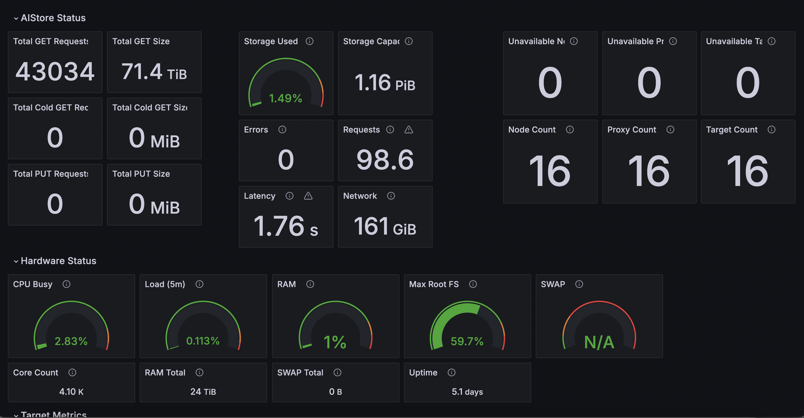

# Helm charts for AIS Cluster Monitoring

### Getting started
1. Install and configure [helm](https://helm.sh/docs/intro/install/) and [helmfile](https://helmfile.readthedocs.io/en/latest/#installation) (including configuring kubectl context for your cluster).
1. If using local storage for persistence, set up a storage class on your cluster that can handle dynamic persistent volumes. We use [Rancher's local-path-provisioner](https://github.com/rancher/local-path-provisioner) by default.
1. Label nodes for scheduling monitoring pods if using affinity: `kubectl label node/your-node 'aistore.nvidia.com/role_monitoring=true'`.
1. Create an environment for your deployment based on the values files for either the default (everything) or the external deployment (no grafana/loki).
1. Update the values for your deployment environment
1. Export any required environment variables (e.g. if bundling grafana, `export GRAFANA_PASSWORD=<password>`).
1. Run `helmfile sync` or `helmfile --environment <your-env> sync`.
1. [Access Grafana from an external machine](#external-access).

With the proper values configured, all tools should automatically sync and provide data in the grafana dashboard. 

Most chart values are set in the source charts or in the `values.yaml.gotmpl` in each chart's directory. To configure a specific deployment, create an environment file and replace `default.yaml` in the helmfile or create a new environment. 

### Environment variables 

- Grafana admin user login
    - `export GRAFANA_PASSWORD=<password>`

### Security context

For setting the `securityContext`, specify details of a non-root user (typically UID > 1000). To identify existing non-root users, use the following command:
   ```bash
   awk -F: '$3 >= 1000 {print $1}' /etc/passwd
   ```

Alternatively, you can either use an existing non-root user or create a new one. To obtain the UID and Group ID (GID) of a user, execute:

   ```bash
   id [username]
   ```

Then, update your deployment environment file with the user's UID and GID by setting the `runAsUser`, `runAsGroup`, and `fsGroup` fields, under `securityContext`.

### Alerting

[AlertManager](https://prometheus.io/docs/alerting/latest/alertmanager/) supports various receivers, and you can configure them as needed. We include a slack alert in our config file in [kube-prom/alertmanager_config](kube-prom/alertmanager_config.yaml.gotmpl), but more can be added. Refer to the [Prometheus Alerting Configuration](https://prometheus.io/docs/alerting/latest/configuration/#general-receiver-related-settings) for details on each receiver's config.

### AIS Metrics

To monitor AIS, create [PodMonitor](https://github.com/prometheus-operator/prometheus-operator/blob/main/Documentation/api.md#monitoring.coreos.com/v1.PodMonitor) definitions.

You can find an AIS `PodMonitor` definition in [`ais_podmonitors.yaml`](kube-prom/ais_podmonitors.yaml) which will be automatically applied after syncing the kube-prometheus chart. 

When applied, the monitors will configure prometheus to scrape metrics from AIStore's proxy and target pods individually every 30 seconds.

### <a id="external-access"></a> Accessing internal services (Prometheus, Grafana)

The web services for Prometheus and Grafana are not directly accessible from outside the cluster. Options include changing the service type to `NodePort` or using port-forwarding. Use `kube-prometheus-stack-prometheus` for the Prometheus service and `kube-prometheus-stack-grafana` for Grafana. Below are instructions for Grafana.

1. Configure access from the host into the pod by using ONE of the following
    1. Port-forward: `kubectl port-forward --namespace monitoring service/kube-prometheus-stack-grafana 3000:80`
    1. Patch the service to use NodePort: `kubectl patch svc kube-prometheus-stack-grafana -n monitoring -p '{"spec": {"type": "NodePort"}}'`
    1. Create a separate NodePort or LoadBalancer service: [k8s docs](https://kubernetes.io/docs/concepts/services-networking/service/)

> If needed, use an ssh tunnel to access the k8s host: `ssh -L <port>:localhost:<port> <user-name>@<ip-or-host-name>` and view `localhost:<port>`

> For Grafana, login with the admin user and the password set with the `GRAFANA_PASSWORD` environment variable




## Included charts:

### Promtail ###
- Ships K8s logs to Loki
- [Main docs](https://grafana.com/docs/loki/latest/send-data/promtail/)
- [Chart source](https://github.com/grafana/helm-charts/tree/main/charts/promtail)

### Kube-prometheus ### 
- [Prometheus stack](https://github.com/prometheus-community/helm-charts/tree/main/charts/kube-prometheus-stack)
- Includes
   - [Prometheus](https://prometheus.io/) and the [Prometheus Operator](https://github.com/prometheus-operator/prometheus-operator)
   - [AlertManager](https://prometheus.io/docs/alerting/latest/alertmanager/)
   - [Grafana](https://grafana.com/)
   - [kube-state-metrics](https://github.com/kubernetes/kube-state-metrics)
   - [node_exporter](https://github.com/prometheus/node_exporter)

### Loki ###
- Log storage and search
- [Main docs](https://grafana.com/docs/loki/latest/)
- [Chart source](https://github.com/grafana/loki/tree/main/production/helm/loki)
- [Additional values options](https://grafana.com/docs/loki/latest/setup/install/helm/reference/)

### Grafana ###
- Visualization, dashboards, log search, metrics, etc. 
- https://grafana.com/
- [Chart source](https://github.com/grafana/helm-charts/blob/main/charts/grafana/README.md)